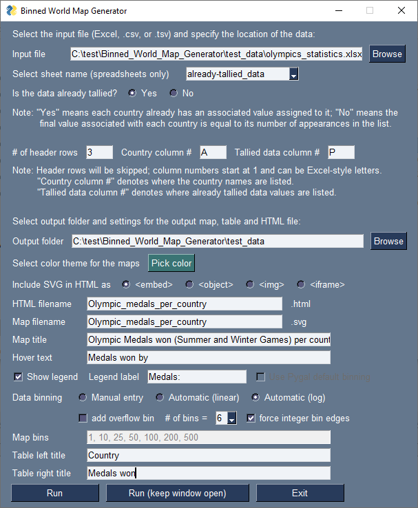
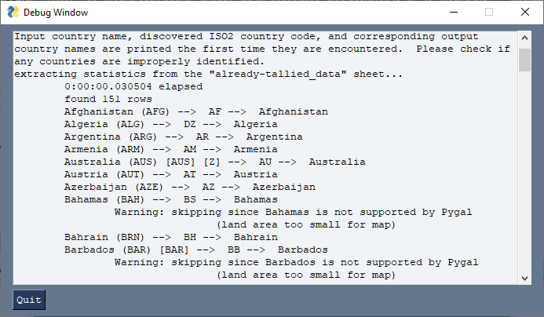

# Interactive_world_data_map_generator

This utility consists of a single Python script and is an easy-to-use tool for making custom interactive Scalable Vector Graphics (SVG) world maps showing binned data.  It can handle data which has already been counted (a list of Countries with values provided) as well as data which has not been binned yet (a list of Countries to be counted), and it supports Excel files and comma/tab delimited text files (CSV/TSV).  It features a GUI for easily manipulating the various parameters controlling the output.  Below is an example map made with this tool showing the number of [Olympic medals won](https://en.wikipedia.org/wiki/All-time_Olympic_Games_medal_table) by each country.  Since GitHub does not allow interactive SVG files to be displayed here, click the static image (or [here](https://lindt8.github.io/hobby-code-projects/)) to view the interactive version on a separate page.

<!--

<object data="test_data/Olympic_medals_per_country.svg" type="image/svg+xml" style="width:50%;"></object>

-->

 

In addition to Python's standard libraries, this tool requires the following additional libraries:

* [Numpy](https://pypi.org/project/numpy/)
* [openpyxl](https://pypi.org/project/openpyxl/)
* [Pygal](https://pypi.org/project/pygal/) [[webpage](http://www.pygal.org/en/stable/)]
* [pygal_maps_world](https://pypi.org/project/pygal_maps_world/)
* [PySimpleGUI](https://pypi.org/project/PySimpleGUI/)

Once you have those libraries installed, you're good to go!  Upon running the script, the GUI pictured below (but with default entries) will appear.  For convenience, you may specify the path to the default data file in a text file called ``default_path_to_data_file.txt`` located in the same folder as ``interactive_world_map_generator.py``; otherwise, the code will default to the folder from which the Python script is being ran in the file/folder prompts.

Some options will be enabled/disabled automatically depending on your selections.  For instance, the "Tallied data column #" entry will become disabled if "No" is selected for whether the data is already tallied since, in that scenario, the code will only count the number of instances each country's name appears.  When "Yes" is selected, columns for country names and the values associated with them must be provided (as is the case with the [Olympic medals](https://en.wikipedia.org/wiki/All-time_Olympic_Games_medal_table) data in this example).

The "Run" button closes the window and runs the code, printing information to the terminal as usual.  The "Run (keep window open)" button will run the code but keep the window open in the background, redirecting terminal output to a popup window like the one shown below.  This is a useful feature if actively iterating on a map's design (colors, binning, etc.).

Upon the first time a file or specific spreadsheet is read, the checks shown in the above terminal window will be made.  The code prints the input country name, the ISO2 code for that country (identified by country_converter and used by Pygal), and the name of the country that ISO2 code corresponds to.  This serves to alert you if any countries are not properly identified and need to have their names modified/corrected.  (Note:  The country_converter library used for parsing country names will accept a wide variety of formats; the country name strings here were just copied directly from the Wikipedia table with barely any alteration.)

After the data file has been read once, the data along will all of the settings in the GUI are saved into a ``.pickle`` file of the same name as the source data file.  When the code is provided that same source data file in the future and sees the pickle file is present, it will load the previous settings used into the GUI, and the code will use the data from the pickle file which is substantially faster than reparsing the original data file and confirming the identity of each listed country.  However, the code will check to see if the date last modified of the file has changed from when the pickle file was created, and if so, it will reread the data file normally and then update the pickle file.

In the end, it will output the SVG map file and an HTML file containing the map and a table of all of the data in the map.  The SVG is interactive:  You can hover over each country to see its value, and hovering over the legend shows which countries belong to each bin.  Because embedding interactive SVGs into web pages while retaining their interactivity can sometimes be difficult, several embedding options are provided in the GUI.  Though, in your particular environment a different approach or further modifications may be necessary. 
